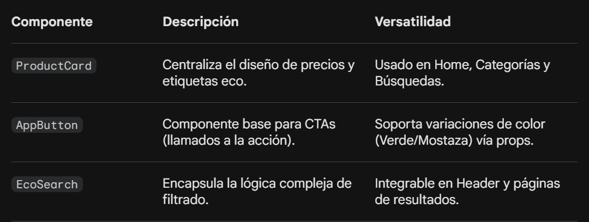

# 🌿 EcoMarket: Propuesta de Reestructuración de Interfaz

## Acerca de este Proyecto

EcoMarket es una plataforma de comercio electrónico comprometida con la venta de productos ecológicos y sostenibles. Este repositorio contiene la **Propuesta Técnica** para la modernización y optimización de la interfaz de usuario, con el objetivo de migrar de una estructura estática a un sistema basado en componentes reutilizables y dinámicos.

---

## 🚀 Objetivos de la Propuesta

- **Modularización**: Eliminar la duplicidad de código mediante componentes atómicos reutilizables que sigan el principio DRY.
- **Eficiencia**: Implementar patrones de diseño como Slots y Componentes Dinámicos para mejorar la mantenibilidad del código.
- **Rendimiento**: Optimizar el uso del ciclo de vida de los componentes (hooks) para el manejo eficiente de datos y prevención de memory leaks.

---

## 🛠️ Arquitectura de Componentes

### 1. Componentes Críticos Identificados

Para cumplir con el principio **DRY (Don't Repeat Yourself)**, se han definido los siguientes elementos base:



### 2. Jerarquía y Flujo de Datos

Se propone una estructura **unidireccional** para garantizar un flujo de datos predecible y mantenible:

| Componente | Responsabilidad |
|-----------|-----------------|
| **Padre (ProductList)** | Gestión de estados globales y llamadas a la API |
| **Hijo (ProductCard)** | Representación visual y emisión de eventos (@add-to-cart) |

---

## 💡 Estrategias de Implementación

### Flexibilidad con Slots y :is

- **EcoModal**: Implementación de slots para inyectar contenido dinámico (formularios, detalles de productos) manteniendo una estructura de contenedor única y reutilizable.
- **Panel de Usuario**: Uso de componentes dinámicos con la directiva `:is` para alternar entre vistas (Pedidos, Configuración, Lista de Deseos) sin recargas innecesarias de ruta.

### Gestión del Ciclo de Vida

Se prioriza el control de los hooks de Vue.js para mejorar la experiencia de usuario:

- **onMounted**: Carga del catálogo de productos desde la API de EcoMarket.
- **onBeforeUnmount**: Limpieza de procesos y prevención de fugas de memoria (memory leaks).

---

## 🎨 Estándares de Estilo

La interfaz sigue una línea estética moderna y coherente:

- **Encapsulamiento**: Uso estricto de `<style scoped>` para evitar colisiones de CSS entre componentes.
- **Binding Dinámico**: Uso de `:class` y `:style` para aplicar estados visuales dinámicos (ej. bordes destacados para productos orgánicos).
- **Identidad Visual**: Implementación de una paleta de colores basada en tonos naturales (Verde Eco y Mostaza) que reflejan los valores sostenibles de EcoMarket.

---

## 📈 Ventajas del Nuevo Sistema

- **Mantenibilidad**: Los cambios globales se realizan en un único punto de entrada, reduciendo errores y ahorrando tiempo.
- **Escalabilidad**: La estructura modular facilita la adición de nuevas funcionalidades sin afectar el núcleo del sistema.
- **Colaboración**: Arquitectura que permite el trabajo paralelo entre múltiples desarrolladores sin conflictos.

---

## 📋 Requisitos Previos

- Node.js >= 16.x
- npm o yarn
- Vue.js 3.x

---
## 📝 Contribuciones
Las contribuciones son bienvenidas. Por favor:

Fork el repositorio
Crea una rama para tu feature (git checkout -b feature/AmazingFeature)
Commit tus cambios (git commit -m 'Add AmazingFeature')
Push a la rama (git push origin feature/AmazingFeature)
Abre un Pull Request
## 📄 Licencia
Este proyecto está licenciado bajo la Licencia MIT. Ver el archivo LICENSE para más detalles.

## 👨‍💻 Créditos y Autor
Desarrollado por: Jimena Traipe
Especialidad: Front-End Application Development | Vue.js


---

## 🚀 Instalación y Ejecución Local

```bash
# Clonar el repositorio
git clone https://github.com/Traipe/EcoMarket.git
cd EcoMarket

# Instalar dependencias
npm install

# Ejecutar el servidor de desarrollo
npm run dev

# Compilar para producción
npm run build


## 📧 Contacto
Para preguntas o sugerencias, no dudes en contactarme a través de GitHub Issues o abrir un Pull Request.
