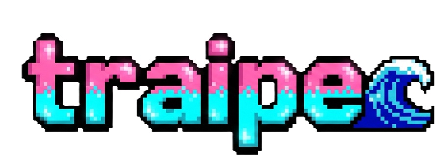

🌿 EcoMarket: Propuesta de Reestructuración de Interfaz
Este repositorio contiene la Propuesta Técnica para la modernización y optimización de la interfaz de EcoMarket. El objetivo principal es migrar de una estructura estática a un sistema basado en componentes reutilizables bajo el ecosistema de Vue.js, garantizando escalabilidad y mantenibilidad.

🚀 Objetivos de la Propuesta
Modularización: Eliminar la duplicidad de código mediante componentes atómicos.

Eficiencia: Implementar patrones de diseño como Slots y Componentes Dinámicos.

Rendimiento: Optimizar el uso del ciclo de vida de los componentes para el manejo de datos.

🛠️ Arquitectura de Componentes
1. Componentes Críticos Identificados
Para cumplir con el principio DRY (Don't Repeat Yourself), se han definido los siguientes elementos base:

[text](EcoMarket/src/image.png)

2. Jerarquía y Flujo de Datos
Se propone una estructura unidireccional para un flujo de datos predecible:

Padre (ProductList): Gestión de estados y llamadas a la API.

Hijo (ProductCard): Representación visual y emisión de eventos (@add-to-cart).

💡 Estrategias de Implementación
Flexibilidad con Slots y :is
EcoModal: Implementación de slots para inyectar contenido dinámico (formularios o detalles) manteniendo una estructura de contenedor única.

Panel de Usuario: Uso de componentes dinámicos con la directiva :is para alternar vistas (Orders, Settings, Wishlist) sin recargas innecesarias de ruta.

Gestión del Ciclo de Vida
Se prioriza el control de los hooks para mejorar la experiencia de usuario:

onMounted: Carga de catálogo desde la API de EcoMarket.

onBeforeUnmount: Limpieza de procesos y prevención de fugas de memoria (memory leaks).

🎨 Estándares de Estilo
La interfaz sigue una línea estética moderna y coherente:

Encapsulamiento: Uso estricto de <style scoped> para evitar colisiones de diseño.

Binding Dinámico: Uso de :class y :style para estados visuales (ej. bordes destacados para productos orgánicos).

Identidad Visual: Implementación de una paleta basada en tonos naturales (Verde Eco y Mostaza).

📈 Ventajas del Nuevo Sistema
Mantenibilidad: Cambios globales realizados en un solo punto de entrada.

Escalabilidad: Facilita la adición de nuevas funcionalidades sin afectar el núcleo del sistema.

Colaboración: Estructura que permite el trabajo paralelo entre múltiples desarrolladores.

Desarrollado por: Jimena Traipe

Especialidad: Front-End Application Development | Vue.js